# OrgAI Finance App Architecture

## Overview
OrgAI Finance App is a SwiftUI-based iOS application for managing personal and business finances. The app follows MVVM architecture and uses SwiftData for persistence.

## Core Components

### Models
- `Account`: Represents financial accounts with properties for name, balance, type, and category
- `Transaction`: Represents financial transactions (planned for future implementation)

### Views
- `AccountView`: Main view for displaying accounts and financial summary
  - Shows total assets, liabilities, and net worth
  - Organizes accounts by type (Personal, Business) and category
  - Implements custom UI components for consistent financial data display

### Financial Calculations
The app implements several key financial calculations:

#### Net Worth Calculation
```swift
Net Worth = Total Assets - abs(Total Liabilities)
```
- Assets: Sum of all positive balances from non-liability accounts
- Liabilities: Sum of all negative balances (stored as absolute values)

#### Account Categorization
- Personal Accounts: Checking, Savings, Credit Cards
- Business Accounts: Checking, Savings, Credit Cards
- Assets: Real Estate, Vehicles, Investments
- Liabilities: Mortgages, Loans, Credit Card Debt

### UI Components
- `SummaryBox`: Displays financial metrics with color-coded values
- `CustomDisclosureGroup`: Expandable/collapsible account sections
- `AnimatedAmountView`: Animated display of changing financial values

## Data Flow
1. SwiftData manages persistent storage of accounts
2. AccountView observes changes in the account data
3. Financial calculations are performed in real-time
4. UI updates automatically reflect data changes

## Design System
- Consistent color scheme for financial status indication
- Typography system for hierarchical information display
- Spacing and layout guidelines for uniform appearance

## Testing Strategy
- Unit tests for financial calculations
- UI tests for critical user flows
- Test data for consistent testing scenarios

## Future Enhancements
- Transaction tracking and categorization
- Budget planning and monitoring
- Financial goal setting and tracking
- Investment portfolio management
- Reports and analytics

## 1. App Structure

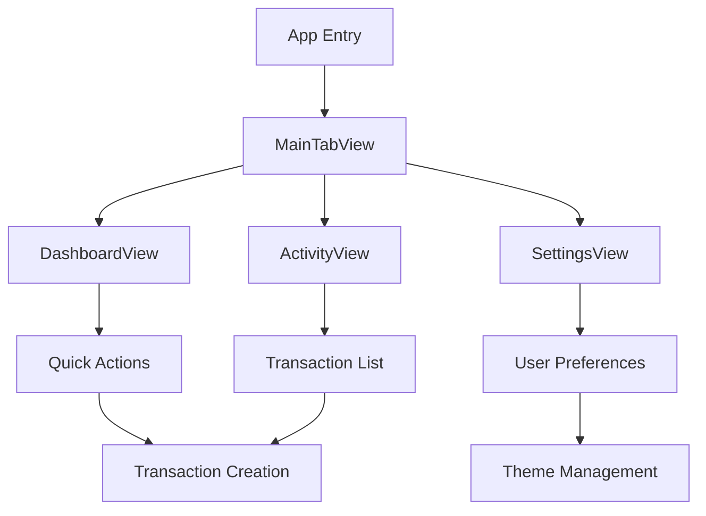

## 2. Data Flow

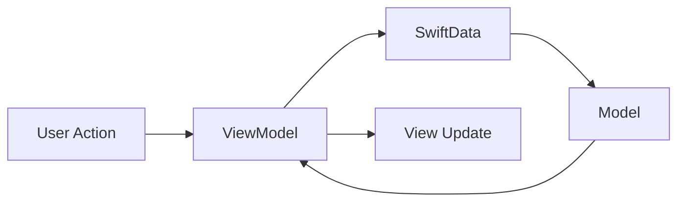

## 3. MVVM Architecture

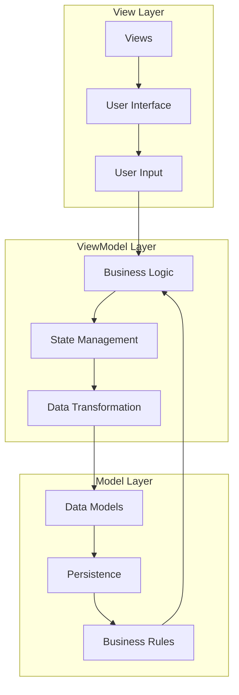

## 4. Authentication Flow

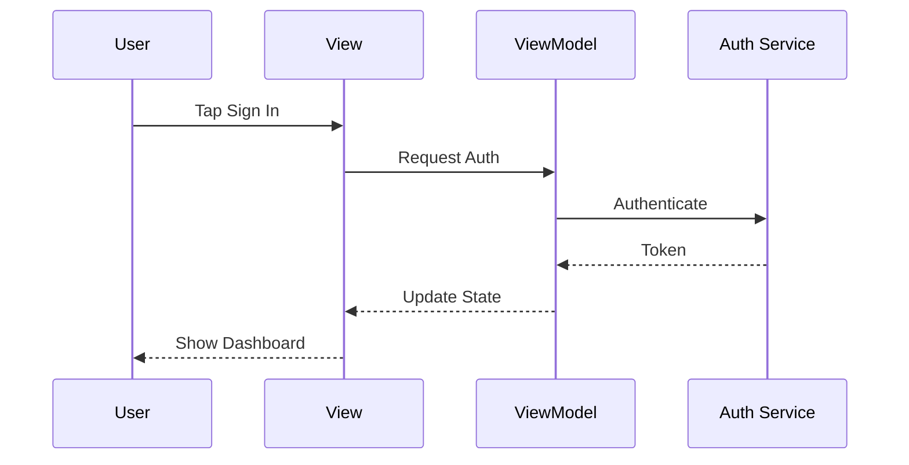

## 5. Transaction Flow

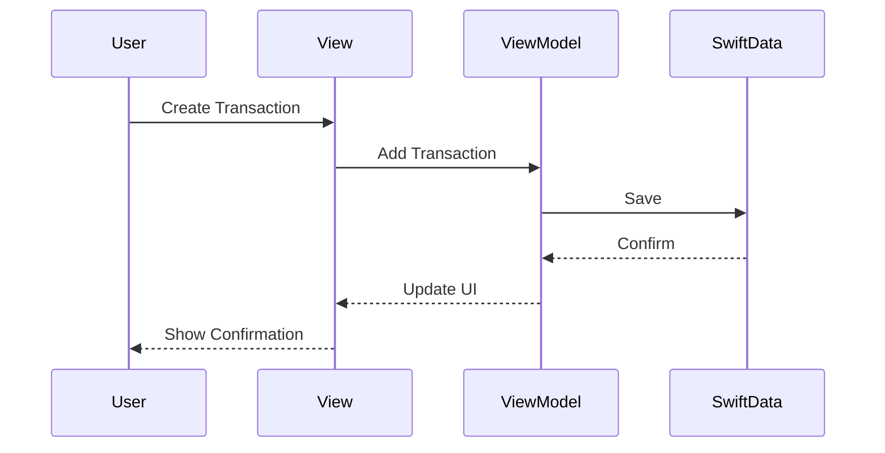

## 6. Component Structure

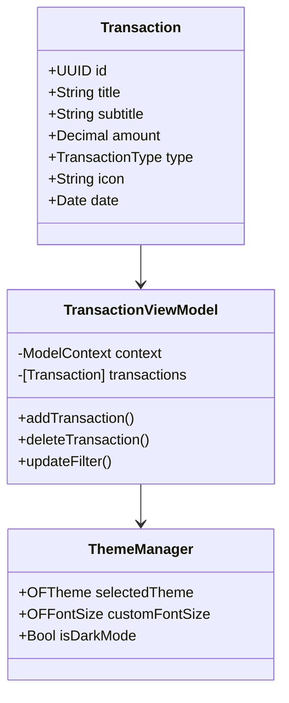

## 7. Error Handling

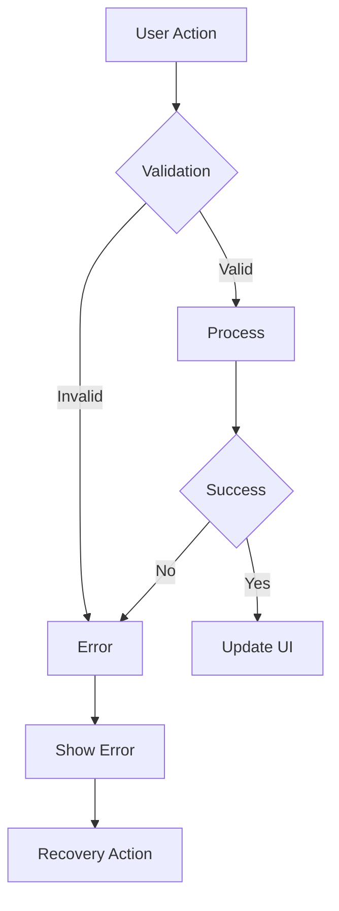

## 8. State Management

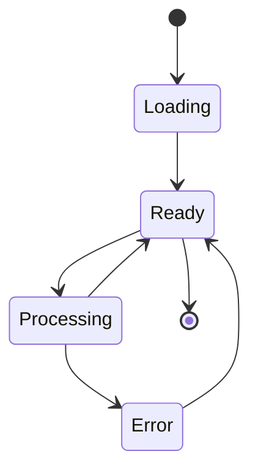

## 9. Design System

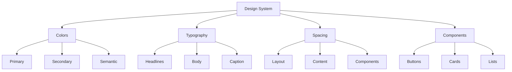

## 10. Testing Strategy

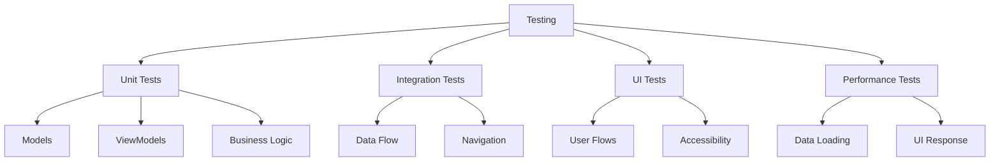

## 11. Deployment Flow

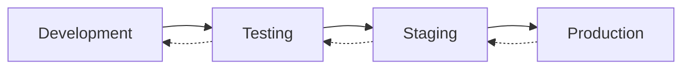

## 12. Security Model

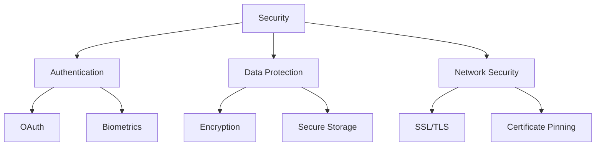