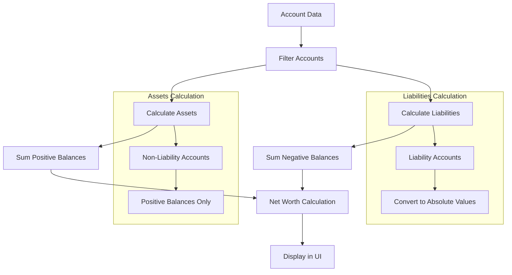
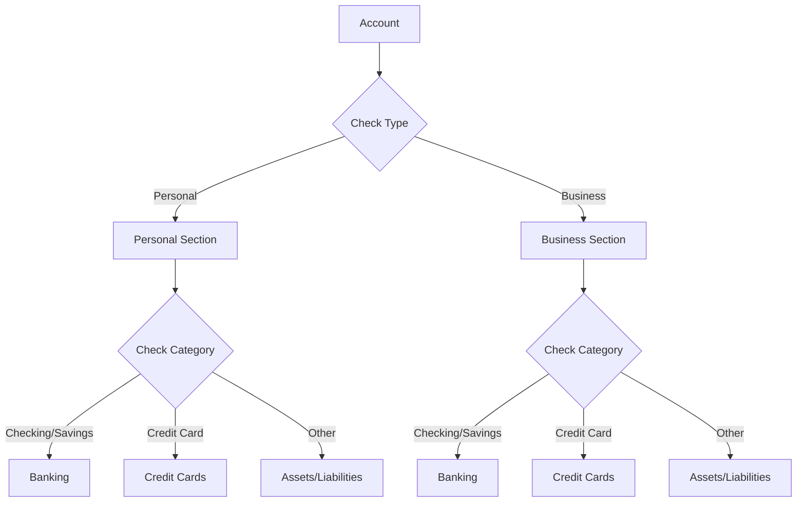
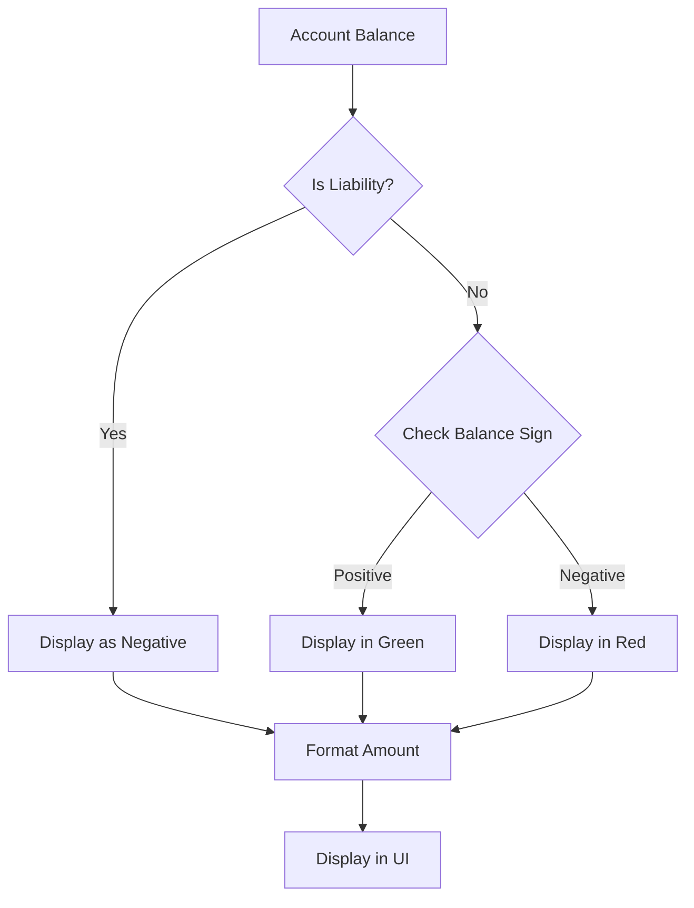
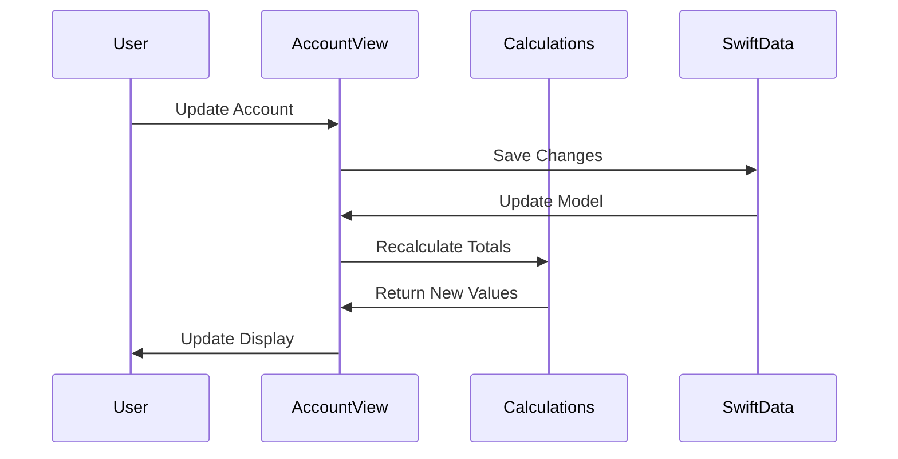

# Financial Calculations Flow

## Net Worth Calculation Flow

```mermaid
graph TD
    A[Account Data] --> B[Filter Accounts]
    B --> C[Calculate Assets]
    B --> D[Calculate Liabilities]
    C --> E[Sum Positive Balances]
    D --> F[Sum Negative Balances]
    E --> G[Net Worth Calculation]
    F --> G
    G --> H[Display in UI]
    
    subgraph Assets Calculation
    C --> C1[Non-Liability Accounts]
    C1 --> C2[Positive Balances Only]
    end
    
    subgraph Liabilities Calculation
    D --> D1[Liability Accounts]
    D1 --> D2[Convert to Absolute Values]
    end
```

## Account Categorization Flow

```mermaid
graph TD
    A[Account] --> B{Check Type}
    B -->|Personal| C[Personal Section]
    B -->|Business| D[Business Section]
    
    C --> E{Check Category}
    D --> F{Check Category}
    
    E -->|Checking/Savings| G[Banking]
    E -->|Credit Card| H[Credit Cards]
    E -->|Other| I[Assets/Liabilities]
    
    F -->|Checking/Savings| J[Banking]
    F -->|Credit Card| K[Credit Cards]
    F -->|Other| L[Assets/Liabilities]
```

## Balance Display Logic

```mermaid
graph TD
    A[Account Balance] --> B{Is Liability?}
    B -->|Yes| C[Display as Negative]
    B -->|No| D{Check Balance Sign}
    D -->|Positive| E[Display in Green]
    D -->|Negative| F[Display in Red]
    C --> G[Format Amount]
    E --> G
    F --> G
    G --> H[Display in UI]
```

## Data Flow

```mermaid
sequenceDiagram
    participant U as User
    participant V as AccountView
    participant C as Calculations
    participant D as SwiftData
    
    U->>V: Update Account
    V->>D: Save Changes
    D->>V: Update Model
    V->>C: Recalculate Totals
    C->>V: Return New Values
    V->>U: Update Display
``` 